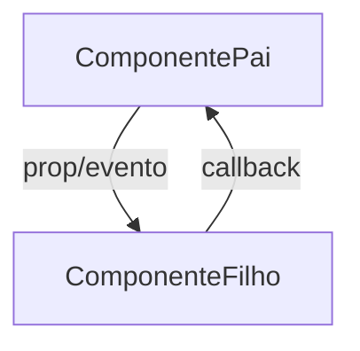

# [TÍTULO DO AJUSTE] — Planning Output (vX)

> **Status:** PLANEJADO — Aguardando aprovação  
> **Data:** YYYY-MM-DD  
> **Scope:** `[rota(s) afetada(s)]`  
> **Files:** N arquivos (X novos, Y modificados)  
> **Risk:** 🟢 LOW | 🟡 MEDIUM | 🔴 HIGH

---

## 1. Contexto

<!-- Descreva o contexto técnico do ajuste: o que existe hoje, o que precisa mudar e por quê. -->

---

## 2. Referência de Código Mapeada

> **REGRA MANDATÓRIA:** Toda referência de código existente que será utilizada, estendida ou servir de base para a implementação DEVE ser mapeada aqui com:
> - Link para o arquivo + linhas exatas
> - O código de referência transcrito (snippet real do repo)

### 2.1 [Nome do Padrão/Componente de Referência]

[NomeDoArquivo.ext](file:///caminho/absoluto/para/arquivo#LXXX-LYYY)

```language
// TRANSCREVER o código de referência real aqui
// Exemplo: o overlay pattern, o hook pattern, o state management pattern
```

### 2.2 [Outro Padrão de Referência]

[OutroArquivo.ext](file:///caminho/absoluto/para/arquivo#LXXX-LYYY)

```language
// TRANSCREVER o código de referência real aqui
```

<!-- Repetir para cada bloco de referência necessário -->

---

## 3. Lógica de Implementação

> **REGRA MANDATÓRIA:** A lógica de implementação DEVE ser escrita e codificada neste documento ANTES de qualquer execução. Isso inclui:
> - Código novo criado para resolver o problema
> - Código encontrado via `context7` (documentação atualizada)
> - Código encontrado no repositório atual (padrões existentes)
> - Cada bloco deve indicar sua ORIGEM: `[CRIADO]`, `[CONTEXT7]`, ou `[REPO EXISTENTE]`

### 3.1 [Título da Lógica — ex: Trigger Logic]

**Origem:** `[CRIADO]` | `[CONTEXT7]` | `[REPO EXISTENTE]`

```language
// Código da lógica de implementação
// Deve ser implementável — não pseudo-código
```

### 3.2 [Título da Lógica — ex: State Management]

**Origem:** `[CRIADO]` | `[CONTEXT7]` | `[REPO EXISTENTE]`

```language
// Código da lógica de implementação
```

<!-- Repetir para cada bloco de lógica -->

---

## 4. Arquitetura de Componentes

<!-- Diagrama mermaid mostrando o fluxo de dados entre componentes -->



---

## 5. CSS/SCSS Reference

<!-- Mapear estilos existentes que serão reutilizados ou estendidos, com código real -->

### 5.1 [Padrão Visual Existente]

[Arquivo.module.scss](file:///caminho/absoluto#LXXX-LYYY)

```scss
// Código CSS/SCSS real do repositório
```

**Adaptações necessárias:**

| Propriedade | Valor Original | Novo Valor |
|-------------|---------------|------------|
| `property` | `original` | `novo` |

---

## 6. Novos Componentes

<!-- Para cada novo componente, especificar: path, props, comportamento, código -->

### 6.1 [NomeComponente.jsx]

**Path:** `src/components/NomeComponente.jsx`

#### Props
```jsx
{
  prop1: type,
  prop2: type,
  onEvent: () => void,
}
```

#### Lógica Core
```jsx
// Código real da implementação do componente
```

---

## 7. Componentes Modificados

<!-- Para cada componente existente que será alterado -->

### 7.1 [NomeArquivo.jsx]

**Novos states/hooks:**
```js
// Código dos novos states
```

**Modificações no código existente:**
```js
// Código mostrando as mudanças
```

**Props adicionais para sub-componentes:**
```jsx
// Código das novas props
```

---

## 8. i18n Keys (se aplicável)

### 8.1 Novas Chaves

```json
{
  "namespace.key": "value"
}
```

### 8.2 Plano de Verificação Anti-Reversão

```bash
# Comandos para verificar que chaves existentes não foram removidas
```

---

## 9. Files Summary

| Action | File | Risk |
|--------|------|------|
| **NEW** | `path/to/new/file` | 🟢 LOW / 🟡 MEDIUM / 🔴 HIGH |
| **MODIFY** | `path/to/existing/file` | 🟢 LOW / 🟡 MEDIUM / 🔴 HIGH |

---

## 10. Implementation Order

1. **Phase A:** [Descrição]
2. **Phase B:** [Descrição]
3. **Phase C:** [Descrição]

---

## 11. Rollback Plan

```
Componentes modificados:
├── Git Ref: HEAD antes da implementação
├── Revert: git checkout <ref> -- [lista de arquivos]
└── Validação: [o que verificar após revert]
```

---

## 12. Verification Plan

| # | Test Case | Route | Expected |
|---|-----------|-------|----------|
| 1 | [Descrição do teste] | `[rota]` | [Resultado esperado] |

---

## 13. Handoff (se aplicável)

<!-- Documentar integrações externas necessárias (N8N, webhooks, backend) -->

### 13.1 [Sistema Externo]

- **O que é necessário:** [descrição]
- **Documento de handoff:** `docs/sessions/YYYY-MM/handoff-[nome].md`
